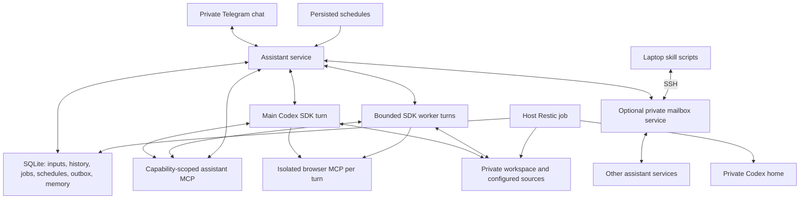

# Current architecture

The application is a Node.js service inside one Docker container per owner.
Codex owns the model/tool loop; the service owns durable orchestration. See
[decisions](decisions.md) for superseded alternatives and [features](features.md)
for the behavior/acceptance inventory.



## Intake, execution and output

main.js validates configuration, opens the database, initializes profiles and
managed instructions, starts loopback health/MCP HTTP, checks login status and
polls Telegram. auth.js owns the login lifecycle using a focused stdio app-server
client in codex-account.js, also shared with usage reads. Missing login keeps
Telegram available while gating model work; switching accounts drains active
turns before authorization. See [authentication](authentication.md). Intake authorizes the owner before downloads or persistence,
deduplicates update IDs, and handles immediate commands/location without a model.
conversations.js routes the owner DM and explicitly linked, addressed groups to
conversation-scoped service instances on one canonical owner database. Each has one main turn and its own
worker threads; a coordinator enforces fair shared execution limits. Stable IDs
survive Telegram renames/migrations. See [conversations](conversations.md).

When Telegram reports private topic mode enabled, the coordinator also routes
owner private messages by chat/topic ID. Topic handles share the canonical database,
owner memory/learning metadata and workspace, but retain independent sessions and
recent context. Their transport wrappers bind every delivery/indicator to the topic;
the default service owns maintenance and instance-wide account lifecycle.

agent.js reads workspace AGENTS.md, SOUL.md and USER.md each turn, removes generated
learning sections, selects application-owned role/delivery instructions, appends
the image-owned stable core and supplies scoped learning records. Role rules are
SDK developer instructions; requests and retrieved sources remain turn input.
See [prompt contracts](prompts.md) for ownership and update behavior.
A separate read-only proposer/validator loop applies service-validated
versioned adaptations; see [learning](learning.md). It supplies recent
history and bounded relevant memory, and runs the pinned SDK with a structured
response schema. The subprocess environment includes required runtime paths and
optional Maps access but excludes the Telegram token and OpenAI API key. Owner
DM and group turns share profiles, knowledge, workspace and configured integrations.
They use danger-full-access/never approvals within granted container access.
Recent history and orchestration queries stay scoped to the source conversation.
An isolated browser process and output directory belong to each turn.

Selected disabled restricted-read attempts first run a bounded pinned stdio
app-server effective-config check of the shell environment and exact assistant MCP
bridge before constructing the SDK. Extra merged configuration fails closed.
This startup loads authentication/cloud/model machinery and local state; anonymous
fixtures do not establish authenticated compatibility. See [action policy](action-policy.md).

The model's MCP stdio bridge calls loopback service HTTP with a fresh capability.
Service-side authorization distinguishes main, worker and curator operations;
tokens are released after a turn. Returned files are validated against workspace
boundaries and queued alongside text/voice. The durable outbox performs delivery,
rate-limit retry and uncertain-outcome classification. Queued is not sent.
Committed outbox inserts wake delivery immediately after initialization; the
one-second scheduler remains a fallback for retries, quiet hours and restarts.
Typing/upload indicators never delay the actual send.

## Durable data

Optional [agent messaging](agent-messaging.md) adds a separate broker database
and local mail inbox/outbox tables. Peer messages queue owner notifications
without entering the main model conversation. Direct owner acceptance creates
a worker for a saved task request. Laptop scripts use JSON over SSH to the broker.

```text
<external-data-root>/NAME/
  workspace/
    AGENTS.md, SOUL.md, USER.md
    inbox/, projects/, tasks/, outputs/
    .agents/skills/                 private generated skills
    skills -> .agents/skills
    memory/                        generated records and private notes
    state/assistant.sqlite         canonical durable service data
    state/locations/               owner-scoped saved locations
    state/python/, state/home/     persistent execution environment
  codex/                           authentication, sessions, config, caches
```

SQLite uses WAL and service transactions. Structured memories have source IDs,
certainty, revision checks and forgetting tombstones; Markdown is a repairable
projection. Startup preserves custom profiles and initializes only missing files
from private seeds or generic templates. Existing owner identity is pinned.

Interrupted work is marked interrupted; in-flight sends become uncertain. Neither
is automatically replayed as if no external effect occurred. Completed worker
text and artifacts are delivered without a main-agent follow-up. Current-session
answers enter history; resumed main turns inject only unseen recent entries. Background
memory and cleanup jobs yield to user interaction; reflection has separate
coverage and notification semantics.

## Configuration and access

Public source includes generic Compose/image definitions. bin/agent selects a
private env file, optional override and stable project name. Each instance owns
its workspace and Codex mounts. Public skills are read-only; mutable copies and
personal sources require explicit private mounts. No inbound host port or Docker
socket is published. The root filesystem is read-only; /tmp is ephemeral;
capabilities are dropped with no-new-privileges and resource limits.

These limits reduce access but do not sandbox every malicious generated program:
normal model code can use its granted workspace, auth state, network and accounts.
Application permissions and instructions must not be described as stronger than
those filesystem/account capabilities. Containers sharing an account also share
that account's usage allowance.

## Backups and verification

Host backup jobs select the container through the same launcher, inventory actual
persistent mounts, create a consistent online SQLite snapshot and back up private
configuration plus mounted data into a separate per-instance Restic repository.
Other files are copied live. Source-sync and runtime storage stay separate.

Tests exercise source contracts; image/runtime tests verify installed tools and
permissions; live acceptance verifies model, Telegram and connector behavior.
See [development](development.md), [deployment](deployment.md), [backups](backups.md).

Ordinary outgoing files are service-generated snapshots under
`state/outbox-artifacts`, inventoried in SQLite before the final response commit.
Outbox rows bind the artifact ID to the original owner/conversation/session/actor.
Delivery verifies the snapshot once and passes those buffered bytes to Telegram,
including photo fallback. Source paths are no longer delivery inputs for ordinary
outputs. See [artifact storage](artifacts.md) for retention and legacy gates.

Context assembly projects host history source labels and bounded terminal-result
model checkpoints without resume authority. Browser output IDs live in turn input;
developer guidance is stable. [Runtime contracts](runtime-contracts.md) bind
schema/parser/supervisor, effective registry metadata, declared versions and the
eight owned skill mounts.
